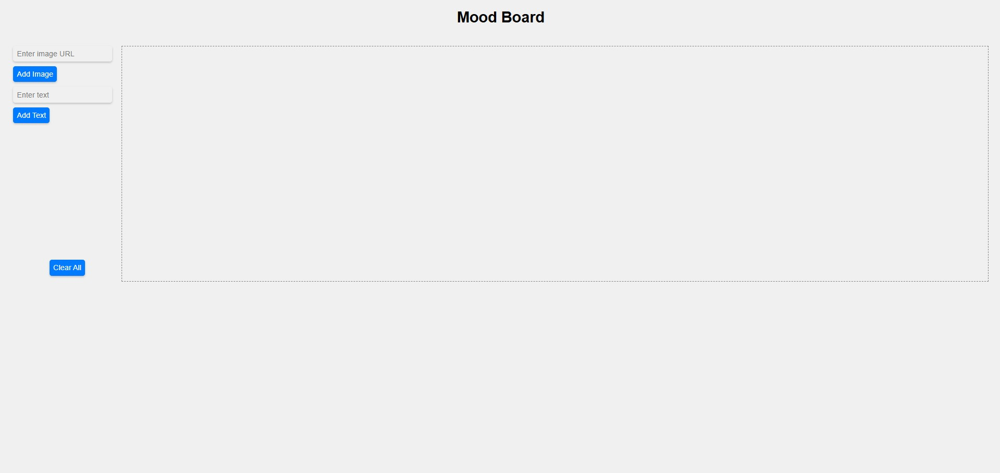

# Mood Board

## Project Overview

This project involves building a dynamic mood board where users can add images or text, drag them onto the board, and save their mood board for later use. The application allows users to interact with elements dynamically and ensures that their mood board persists using local storage.

## Table of Contents

- [Usage](#usage)
- [Mock Up](#mock-up)
- [Instructions](#instructions)
- [Key Features](#key-features)
- [Technology Stack](#technology-stack)
- [Additional Resources](#additional-resources)

## Usage

The application is designed for use in a browser. Users can add images or text, drag them onto the board, and customize their mood board as desired.

## Mock-Up

The following image shows the web application's appearance and functionality:

## Instructions

1. Users can paste an image URL into the input field and click the "Add Image" button to add the image as a draggable element.
2. Users can enter text into the input field and click the "Add Text" button to add the text as a draggable element.
3. Drag-and-drop functionality allows users to position images and text freely on the mood board.
4. The mood board saves automatically to local storage, ensuring persistence across sessions.
5. Clicking the "Clear All" button removes all elements from the mood board and clears the local storage.

## Key Features

* Users can add custom text to the board.
* Users can add images to the board by entering a URL.
* A "Clear All" button clears the mood board and resets local storage.
* Both images and text can be dragged and positioned anywhere on the board.
* The mood board is saved to local storage and persists across browser sessions.

## Technology Stack

This project uses the following technologies:
* **HTML and CSS:** Provide the structure and styling of the mood board interface.
* **LocalStorage:** Ensures the user's mood board data is saved and retrieved across sessions.
* **JavaScript:** Handles dynamic element creation, drag-and-drop functionality, and local storage integration.

## Additional Resources

Learn more about local storage: [MDN Web Docs on localStorage](https://developer.mozilla.org/en-US/docs/Web/API/Window/localStorage)

Learn more about handling mouse events: [MDN Web Docs on MouseEvent](https://developer.mozilla.org/en-US/docs/Web/API/MouseEvent)

Learn more about working with arrays in JavaScript: [MDN Web Docs on Array](https://developer.mozilla.org/en-US/docs/Web/JavaScript/Reference/Global_Objects/Array)

Learn more about loops and iteration in JavaScript: [MDN Web Docs on Loops and Iteration](https://developer.mozilla.org/en-US/docs/Web/JavaScript/Guide/Loops_and_iteration)

Learn more about how to use `addEventListener`: [MDN Web Docs on addEventListener()](https://developer.mozilla.org/en-US/docs/Web/API/EventTarget/addEventListener)

Learn more about `getBoundingClientRect`: [MDN Web Docs on getBoundingClientRect()](https://developer.mozilla.org/en-US/docs/Web/API/Element/getBoundingClientRect)
